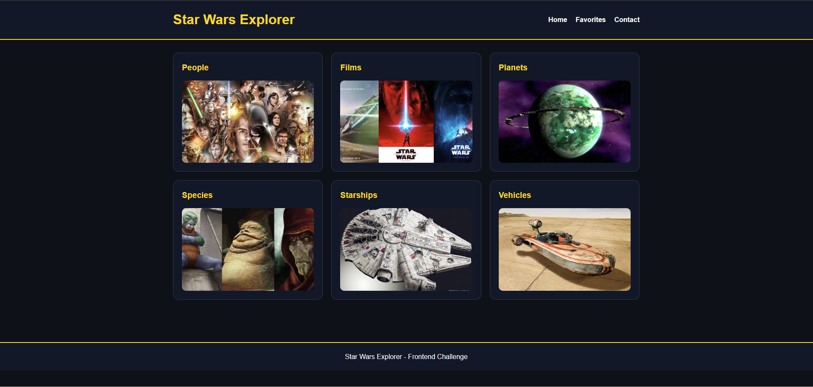
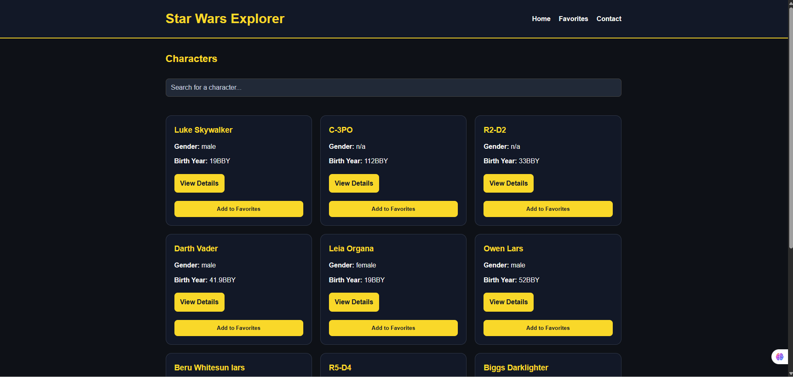

# Star Wars Explorer

Star Wars Explorer is a web application built with HTML, CSS, and Vanilla JavaScript that consumes the SWAPI (Star Wars API) to explore multiple resources from the Star Wars universe.

The project focuses on core frontend concepts such as API consumption, DOM manipulation, responsive design, and client-side data persistence.

---

## Application Preview




---

## Features

The application includes:

- Home page with visual navigation cards
- Characters module:
  - dynamic listing
  - search functionality
  - pagination
  - character details page
  - favorites system using LocalStorage
- Films module:
  - film listing
  - film details with related resources
- Planets module:
  - planet listing
  - planet details with residents and films
- Species module:
  - species listing
  - species details
  - additional page for unspecified species
- Starships module:
  - starship listing
  - starship details with pilots
- Vehicles module:
  - vehicle listing
  - vehicle details
- Favorites page for managing saved characters
- Contact form with validation
- Loading states during API requests
- Responsive layout using CSS Grid and Flexbox

---

## Technologies

- HTML5
- CSS3
- JavaScript (Vanilla)
- SWAPI (https://swapi.dev/)

No frameworks or external libraries were used.

---

## Project Structure

```text
FINAL-STAR_WARS
│
├── css
│   └── style.css
│
├── img
│   ├── films.jpg
│   ├── people.jpg
│   ├── planets.jpg
│   ├── species.jpg
│   ├── starships.jpg
│   ├── vehicles.jpg
│   ├── screenshot-home.png
│   └── screenshot-people.png
│
├── js
│   ├── contact.js
│   ├── details.js
│   ├── favorites.js
│   ├── film-details.js
│   ├── films.js
│   ├── home.js
│   ├── people.js
│   ├── planet-details.js
│   ├── planets.js
│   ├── species-details.js
│   ├── species.js
│   ├── starship-details.js
│   ├── starships.js
│   ├── unspecified-species.js
│   ├── vehicle-details.js
│   └── vehicles.js
│
├── contact.html
├── details.html
├── favorites.html
├── film-details.html
├── films.html
├── index.html
├── people.html
├── planet-details.html
├── planets.html
├── species-details.html
├── species.html
├── starship-details.html
├── starships.html
├── unspecified-species.html
├── vehicle-details.html
├── vehicles.html
└── README.md
```

## How ro Run
1. Clone the repository:<br>
   git clone https://github.com/toledorp/project_StarWar_API
2. Open the project folder.
3. Run using Live Server or open index.html in your browser.

## API
This project uses the public SWAPI:<br>
https://swapi.dev/api/<br>

Endpoints used:<br>
- /people/
- /films/
- /planets/
- /species/
- /starships/
- /vehicles/

## Data Persistence
Favorite characters are stored using LocalStorage with the key:
favoriteCharacters

## Form Validation
The contact from validates:
- **required fields**
- **email format**
Validation is handled on the client side using JavaScript.

## Challenges and Decisions
During development, several challenges were identified and addresed
- **API Structure and Navigation**<br>
Managing relationships betwen resource (films, planets, spicies, starship) required creating dynamic navigation betwen pages.
- **Pagination Implementation**<br>
A custom pagination system was implemented to control the number of characters displayed per page.
- **Lack of Images in API**<br>
Since SWAPI does not provide images, static images were added for the homepage and visual improvements.
- **Handling Missing Data**<br>
Some characters do not have defined species, leading to the creation of a dedicated page for unspecified species.
- **State Management Without Frameworks**<br>
Favorites and UI updates were handled using LocalStorage and manual DOM manipulation.
- **Responsive Design**<br>
Layout adjustments were implemented using CSS Grid and Flexbox to ensure compatibility across different screen sizes.
- **Code Organization**<br>
The project was divided into multiple JavaScript files, each responsible for a specific resource, improving maintainability.

## Author
Developed as part of a frontend development assignment.

## License
This project is intended for educational purpose
